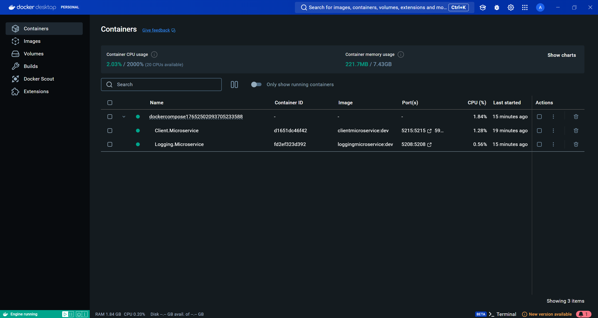
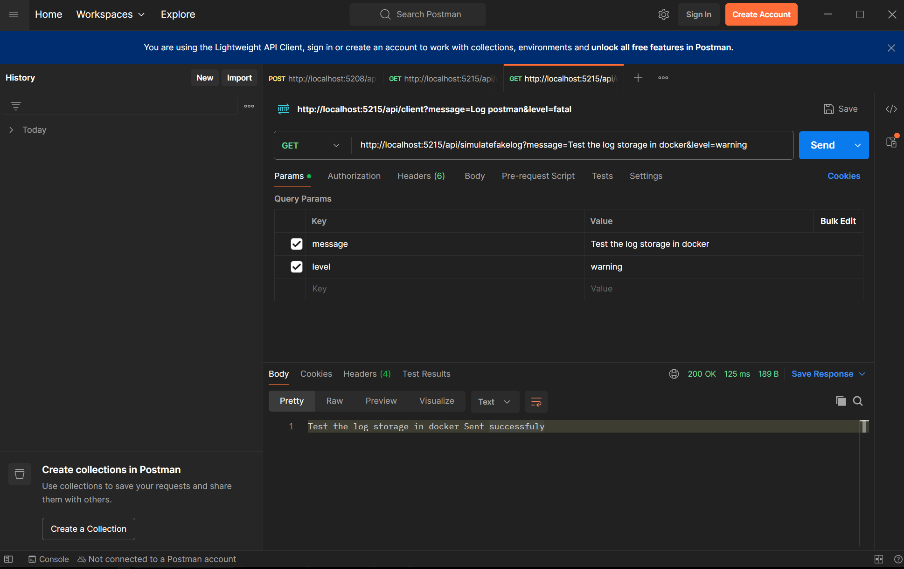
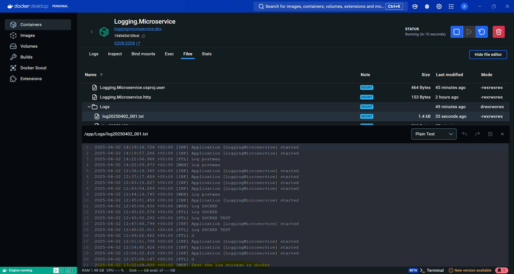

# MyAiropsLogging-v2  

## Running the Application  

To start the services, run:  
```sh
docker-compose up -d
```

## Running Docker Containers  
The following containers should be running after a successful startup:  
  

## Fixed Ports  
- **Logging Service:** `5208`  
- **Client Service:** `5215`  

## Available Log Levels  
The system supports the following log levels:  
- `fatal`  
- `error`  
- `warning`  
- `information`  

## Sending a Log Request  
To simulate a log request, send a GET request via the client service:  
```
http://localhost:5215/api/simulatefakelog?message=somelog&level=fatal
```
Example request in Postman:  
  

## Logging Service Processing  
Once the request is received, it is processed by the logging service:  
  

## Logs Stored in the Logging Service  
The logs are eventually stored:  
  


